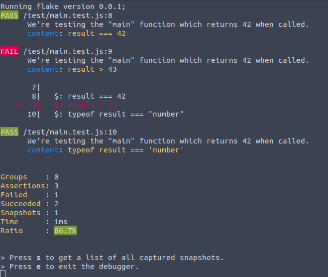
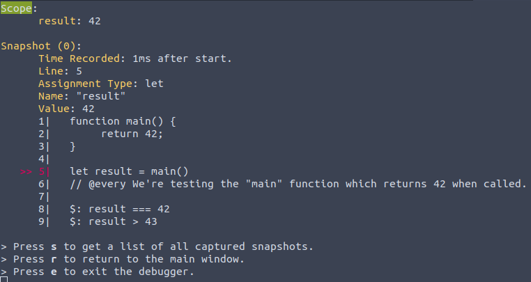

	
	
Flake.js is a test runner that let's you develop in any language with confidence.

Table Of Contents
<ol><li><a href="#contributing">Contributing</a></li><li><a href="#why_flake_">Why Flake?</a></li><li><a href="#usage">Usage</a></li></ol>

## Contributing
If you would like to become a part of our community consider reading this article on [how to become a contributor to the flake repository](https://continuum-ai.de/publishing/@flake/contributing-guide).

## Why Flake?
- Minimal and fast
- Custom syntax
- Easy to use
- No overhead
- Support for many major languages
- One API for everything
- Simple debugging with scope snapshots
- JSDoc Annotations

Main Menu (JS File) | Snapshots Page (JS File)
---------|----------
 | 

## Usage